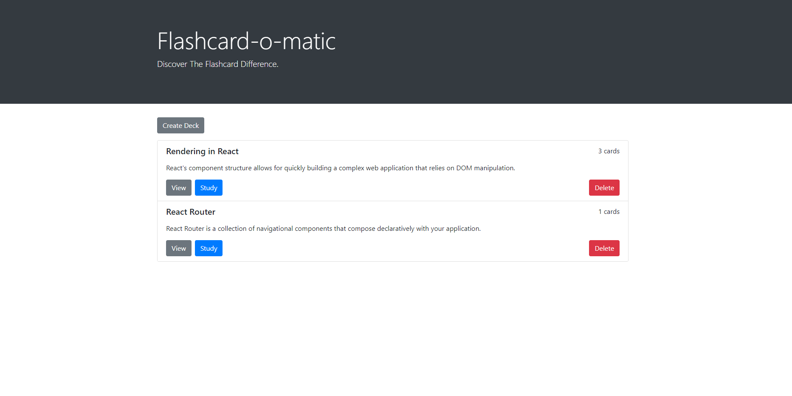
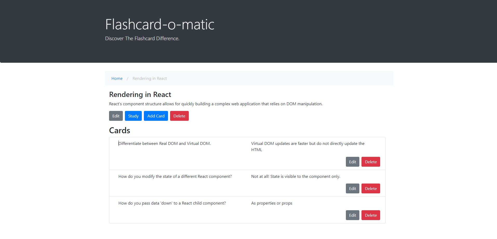
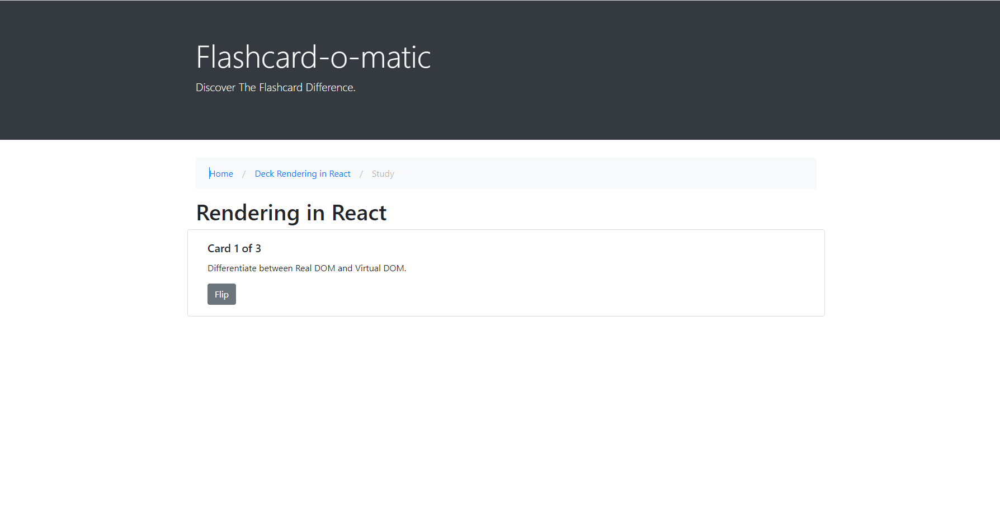
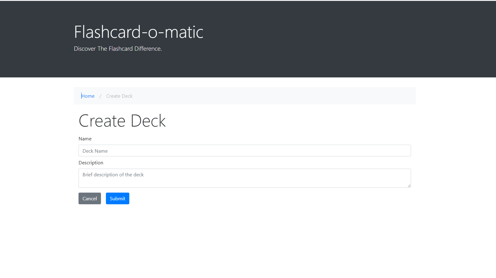
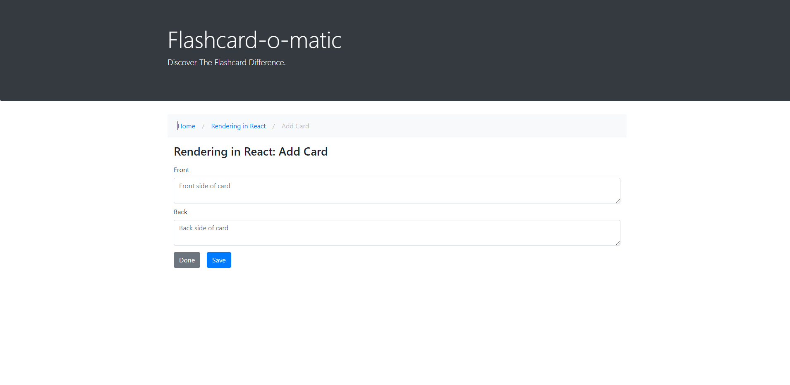

# Flashcard-o-matic

A flashcard app for Thinkful, built as a frontend project using JavaScript, React, CSS, and Bootstrap. This app allows users to create decks, add cards, modify content, and remove both decks and cards.

## Technologies Used

- **JavaScript:** The primary programming language for the application.
- **React:** Frontend JavaScript library used to build the user interface.
- **CSS:** Stylesheets to enhance and customize the visual presentation.
- **Bootstrap:** CSS framework that provides pre-styled components for a responsive and visually appealing UI.

## Features

- **Create Decks:** Users can create custom decks to organize their flashcards.
- **View Decks:** Access and view existing decks with their associated flashcards.
- **Edit Decks:** Modify deck details, such as the title and description.
- **Delete Decks:** Remove unwanted decks and their associated flashcards.
- **Add Cards:** Users can add flashcards to any deck.
- **Delete Cards:** Remove specific flashcards from a deck.
- **Study Decks:** Engage in effective learning by studying decks with flashcards.
- **Edit Cards:** Modify the content of existing flashcards.

## Screenshots








## Getting Started

To run the Flashcard-o-matic app on your local machine, follow these steps:

1. **Clone the Repository:**
   ```bash
   git clone https://github.com/your-username/flashcard-o-matic.git

2. **Install Dependencies**
    cd flashcard-o-matic
    npm install

3. **Run the App**
    npm start

## Usage
1. Open the app in your web browser.
2. Explore existing decks or create a new one.
3. Add flashcards to your decks.
4. Study and quiz yourself with the flashcards.